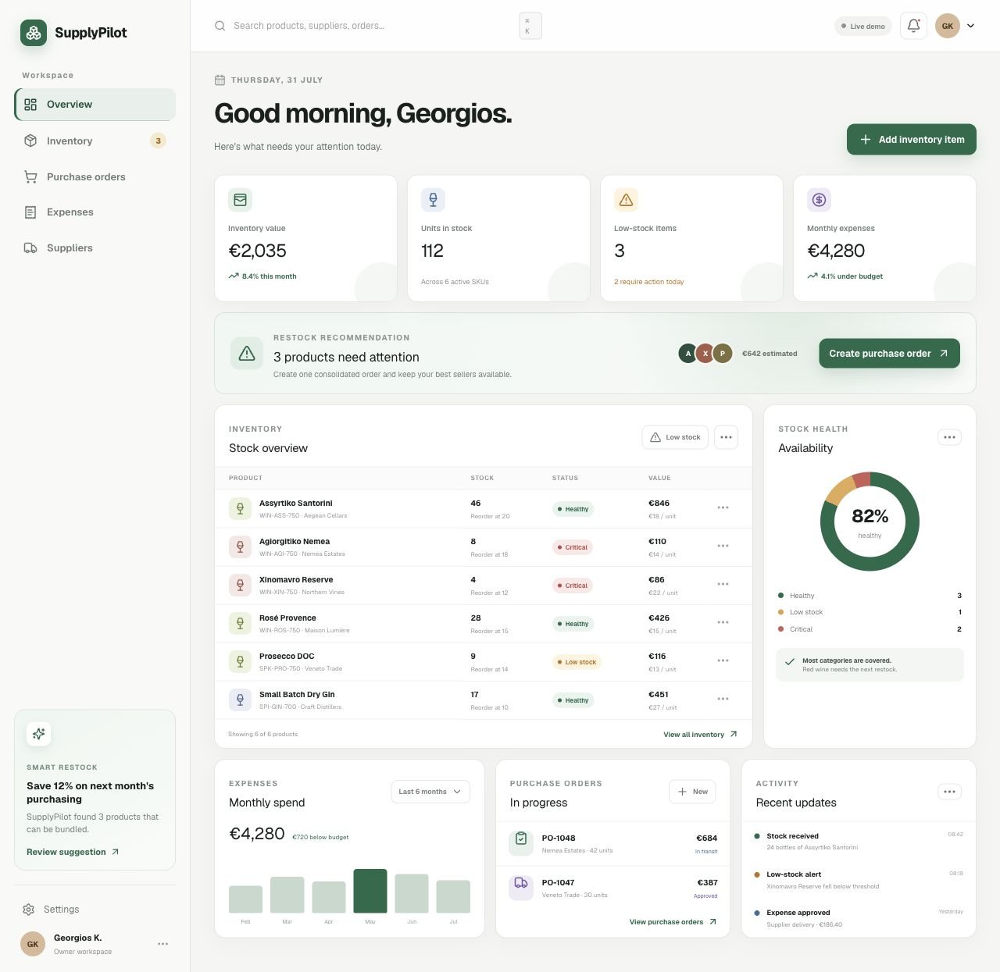
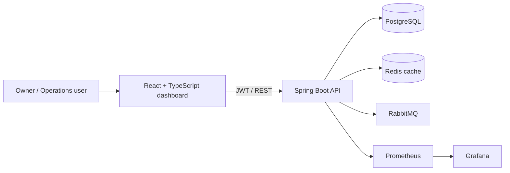

# SupplyPilot

> Inventory, purchasing and expense operations for small retail businesses.

[](https://github.com/GKARAMOU/supplypilot/actions/workflows/ci.yml)
[](https://supplypilot-ops.openai.site)
[](LICENSE)

SupplyPilot is a production-oriented full-stack portfolio project shaped by real
stock and supplier workflows. It gives an owner a fast operational overview,
flags products that need attention and keeps inventory, suppliers, expenses and
purchase orders behind a documented JWT-secured API.

**[Open the live interactive demo](https://supplypilot-ops.openai.site)**



## Why it is useful

- See stock value, units, low-stock risk and monthly spending in one view.
- Search or filter inventory and add new items from the dashboard.
- Turn low-stock products into a purchase-order draft.
- Run the browser demo instantly, or connect the same UI to the Spring Boot API.
- Start the complete local platform—database, cache, events and observability—with one command.

## Architecture



| Layer | Technology |
| --- | --- |
| Web | React 19, TypeScript, Next-compatible routing, Vinext/Vite |
| API | Java 21, Spring Boot 3, Spring Security, JPA |
| Data | PostgreSQL 17, Flyway |
| Platform | Redis, RabbitMQ, Prometheus, Grafana |
| Quality | JUnit 5, MockMvc, Node Test Runner, ESLint, JaCoCo |
| Delivery | Docker Compose, multi-stage images, GitHub Actions, Dependabot |

## Quick start

### Complete platform with Docker

Requirements: Docker Desktop with Compose.

```bash
git clone https://github.com/GKARAMOU/supplypilot.git
cd supplypilot
docker compose up --build
```

Open:

- Dashboard: `http://localhost:3000`
- Swagger UI: `http://localhost:8080/swagger-ui.html`
- API health: `http://localhost:8080/actuator/health`
- RabbitMQ management: `http://localhost:15672` (`guest` / `guest`)
- Prometheus: `http://localhost:9090`
- Grafana: `http://localhost:3001` (`admin` / `supplypilot`)

The local demo API credentials are `demo` / `supplypilot`. Replace every
development credential and the JWT secret before a real deployment.

### Frontend only

Requirements: Node.js 22+.

```bash
npm ci
npm run dev
```

Without `NEXT_PUBLIC_API_URL`, the dashboard uses seeded in-browser data so the
public portfolio demo stays fast and safe. Copy `.env.example` to `.env.local`
and set the API URL to connect it to the backend.

### Backend only

Requirements: Java 21, Maven 3.9+, and PostgreSQL.

```bash
cd backend
mvn spring-boot:run
```

The API applies versioned Flyway migrations on startup. Configuration is
environment-driven; see [`.env.example`](.env.example).

## API workflow

Request a token:

```bash
curl -s http://localhost:8080/auth/token \
  -H 'Content-Type: application/json' \
  -d '{"username":"demo","password":"supplypilot"}'
```

Then send `Authorization: Bearer <accessToken>` to:

| Method | Endpoint | Purpose |
| --- | --- | --- |
| `GET`, `POST` | `/api/products` | List or create inventory |
| `GET`, `PUT`, `DELETE` | `/api/products/{id}` | Manage one product |
| `GET`, `POST`, `DELETE` | `/api/suppliers` | Manage suppliers |
| `GET`, `POST` | `/api/expenses` | Track operational expenses |
| `GET`, `POST` | `/api/purchase-orders` | Manage purchasing |
| `PATCH` | `/api/purchase-orders/{id}/status` | Move an order through its lifecycle |

The full OpenAPI contract is available at `/v3/api-docs`.

## Tests and quality checks

```bash
npm run lint
npm test

cd backend
mvn verify
```

The CI pipeline runs frontend lint/build/render tests, backend integration tests
and both container builds for every pull request and every push to `main`.
JaCoCo writes the Java coverage report to `backend/target/site/jacoco`.

## Production notes

- Use a secret manager for `JWT_SECRET` and database credentials.
- Restrict `CORS_ALLOWED_ORIGINS` to the deployed frontend.
- Use managed PostgreSQL, Redis and RabbitMQ services with encryption and backups.
- Put the API behind HTTPS and a rate-limiting gateway.
- The public demo deliberately keeps mutations in the visitor's browser; it does
  not expose shared credentials or retain personal data.

## Roadmap

- Role-based workspaces for owner, buyer and warehouse users
- CSV inventory import/export
- Purchase-order PDF generation
- Forecast-based reorder quantities
- Audit log and supplier performance scorecards

Built by [Georgios Karamousalis](https://gkaramou.github.io/) ·
[LinkedIn](https://www.linkedin.com/in/giorgos-karamousalis-880731301/) ·
[GitHub](https://github.com/GKARAMOU)
